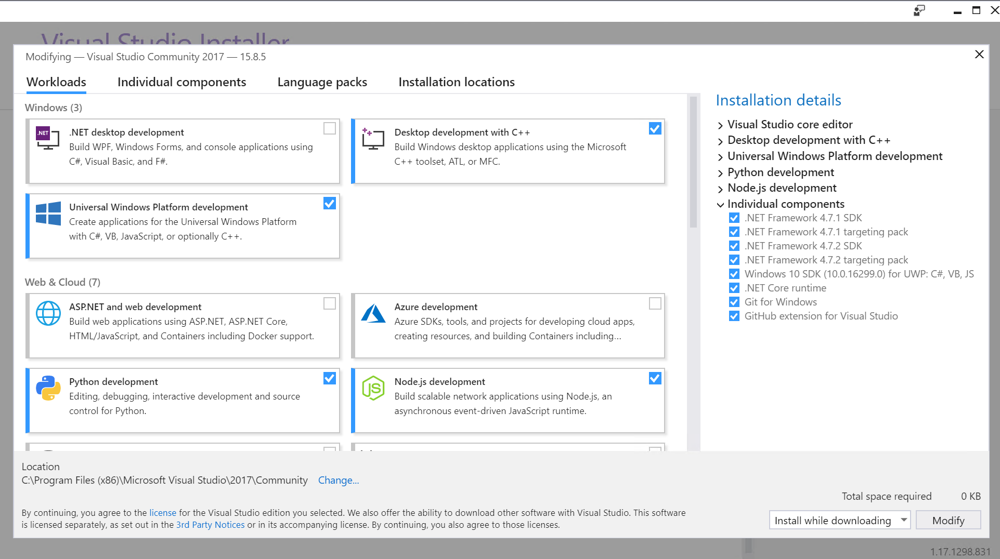

# Fluent Terminal

A Terminal Emulator based on UWP and web technologies.

## Features

- Terminal for PowerShell, CMD, WSL or custom shells
- Supports tabs and multiple windows
- Theming and appearance configuration
- Import/Export themes
- Import iTerm themes
- Fullscreen mode
- Editable keybindings
- Search function
- Configure shell profiles to quickly switch between different shells
- Explorer context menu integration (Installation script can be found [here](https://github.com/felixse/FluentTerminal/tree/master/Explorer%20Context%20Menu%20Integration))

## Screenshots

## Up Next

- Launch shell profile with a custom defined keybinding
- Copy&Paste options
- Improved tabs
- Split screen support

## How to install (as an end-user)

### Automatic install

- Download and extract the latest [release](https://github.com/felixse/FluentTerminal/releases).
- If not already present, download [`Install.ps1`](Install.ps1) to the extracted directory.
- Right-click on `Install.ps1`, and choose "Run with Powershell".
- The installer script will walk you through the rest of the process.

### Manual install

- Download the latest [release](https://github.com/felixse/FluentTerminal/releases)
- [Enable sideloading apps](https://www.windowscentral.com/how-enable-windows-10-sideload-apps-outside-store)
  - Alternatively, [enable developer mode](https://docs.microsoft.com/en-US/windows/uwp/get-started/enable-your-device-for-development) if you plan to do UWP app development. **For most users that do not intend to do UWP app development, developer mode will not be necessary.**
- Install the *.cer file into `Local Machine` -> `Trusted Root Certification Authorities`
  - This will require administrator elevation. If you installed the certificate and did not have to elevate, you likely installed it into an incorrect certificate store.

- double click the *.appxbundle
- **Optional:** Install Context menu integration from [here](https://github.com/felixse/FluentTerminal/tree/master/Explorer%20Context%20Menu%20Integration)

## How to set up a development environment

This is not for the faint of heart, and won't be necessary unless you intend to contribute back to the project.

**When using unattended install helpers, like Chocolatey, you may not have access to all of the necessary installation configuration options. For this it is recommended that you use the installers directly. This applies to both NodeJS and Visual Studio.**

- Grab the [latest NodeJS 8.x installer](https://nodejs.org/en/download/), and install ensuring that both NPM and "install into system PATH" are checked during the install process.
- Grab the [latest Visual Studio 2017 Community installer](https://www.visualstudio.com/downloads/) and install (See next section)
- [Enable developer mode in Windows 10](https://docs.microsoft.com/en-US/windows/uwp/get-started/enable-your-device-for-development)

### Installing Visual Studio 2017

There's some specific parts of VS2017 that we need to make sure are available when you go through the install process.

- Under "Workloads" select:
  - Universal Windows Platform development
  - Node.js development (Probably not required, given we installed Node.js separately)
- Under individual components, you'll need to install the following:
  - Git for Windows
  - .NET Core runtime
  - .NET 4.7.1 Targeting Pack
  - Windows SDK 16299 for UWP: C#, VB, JS

  An example screenshot from the main page of the VS2017 install process for a functioning development environment:

### The First Build

- Before opening the solution, open a Powershell terminal, go into the `FluentTerminal.Client` folder and run:
  - `npm install` (Ignore the warnings related to `fluent-terminal-client`)
  - `npm run build`
- When the solution is first opened, it will help to set the architecture to x64 for testing, as we didn't install the ARM cross-compiling stuff for VS2017 and we only include pre-compiled winpty binaries for x86 and x64.
  - **For this reason, the default architecture of "Any CPU" will fail to build, and you will have to choose either x64 or x86**
- When first built, Visual studio will spend a significant amount of time resolving dependencies, and fetching additional components via nuGet. This is normal.
  - If you have done the steps so far correctly, and the build is left as a debug build, then the solution should build and launch when you press F5.

### Subsequent Builds

- If you change the `FluentTerminal.Client` contents (**OR** if you merge or pull changes that resulted in changes to files in that folder),you'll need to re-run the `npm run build` (and `npm install` if you, or the pulled-in changes, change the dependencies).
- The rest of the build process is as usual through Visual Studio.

### Packaging

- To start, copy the `Package.StoreAssociation.xml.dev` to `Package.StoreAssociation.xml`, this will provide a basic StoreAssociation file to use when building the app.
- With the solution open in Visual Studio, you can build a package for your own use by right-clicking on the `FluentTerminal.App` project in the Solution Explorer and choosing `Store->Create App Packages`
- Follow the prompts to create a package for sideloading, and if this is only for your personal use, it is OK to only build the x64 package, and not include the debug (i.e PDB) symbols.
  - Note that your commits with these settings (as well as a newly generated temporary store key) will involve changes to the `FluentTerminal.App.csproj` file, so be careful about that if you plan to submit them for PRs.
- This will produce, if successful, a folder in `FluentTerminal.App\AppPackages` that you can zip up and share. You'll need to follow the same install instructions as when installing a release from the GitHub repo, including installing the certificate and then installing the appxpackage.
