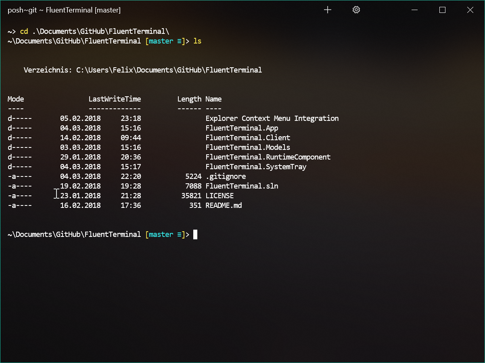
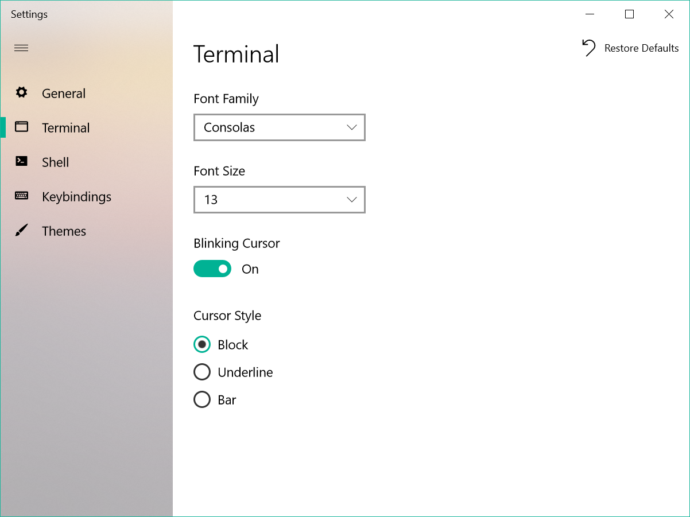

# Fluent Terminal
A Terminal Emulator based on UWP and web technologies.

## Features:
- Terminal for PowerShell, CMD, or custom shells
- Supports tabs and multiple windows
- Theming and appearance configuration
- Editable keybindings
- Search function
- Configure shell profiles to quickly switch between different shells
- Explorer context menu integration (Installation script can be found [here](https://github.com/felixse/FluentTerminal/tree/master/Explorer%20Context%20Menu%20Integration))

## Screenshots:

## Up Next:
- Split screen support
- Full screen mode
- Import/Export themes

## How to install
- activate the developer mode as described [here](https://docs.microsoft.com/en-US/windows/uwp/get-started/enable-your-device-for-development)
- Install the *.cer file into `Local Machine` -> `Trusted Root Certification Authorities`
- double click the *.appxbundle
- Optional: Install Context menu integration from [here](https://github.com/felixse/FluentTerminal/tree/master/Explorer%20Context%20Menu%20Integration))

## How to build:
Build the Client first, or whenever edited by running `npm run build` in FluentTerminal.Client  
Everything else is part of the solution.
