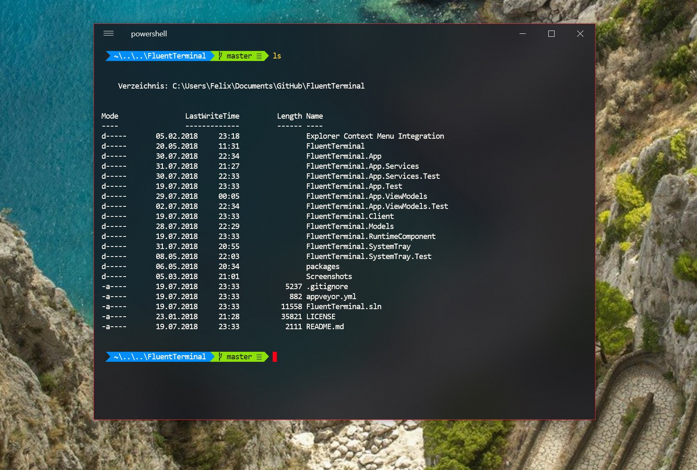
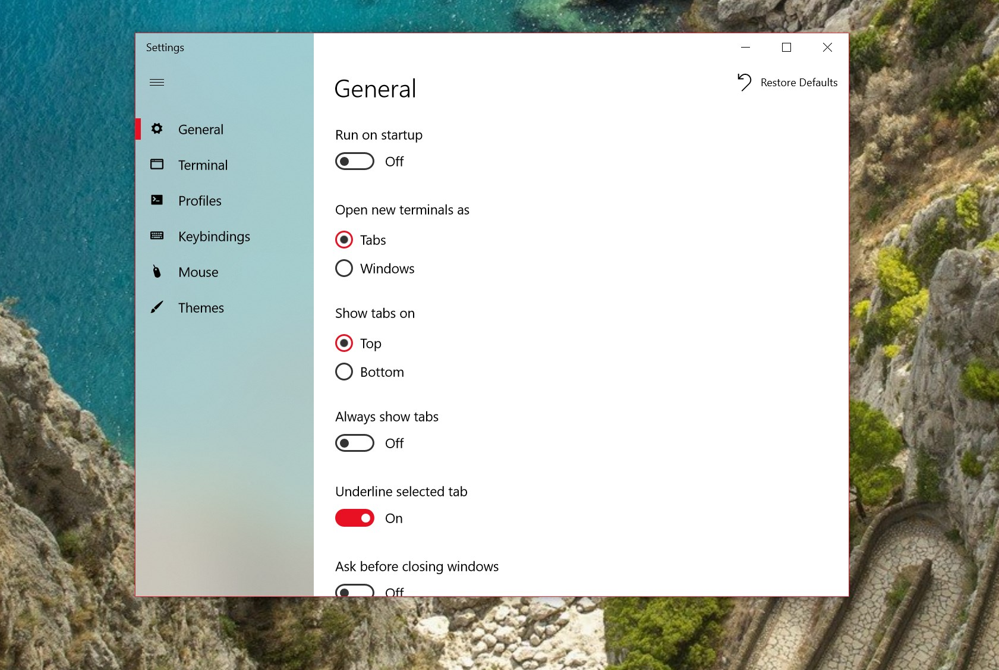
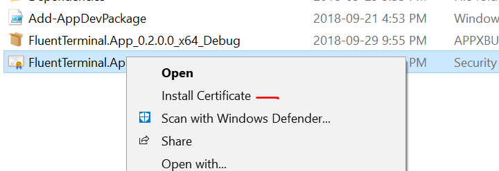
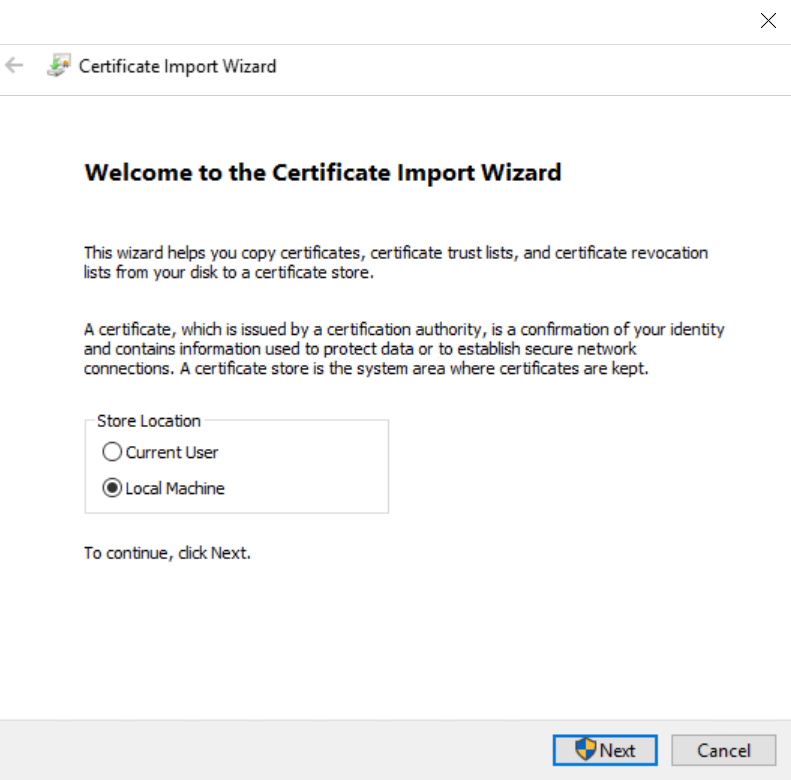

  
  <h1 align="center">Fluent Terminal</h1>

A Terminal Emulator based on UWP and web technologies.

## Features

- Terminal for PowerShell, CMD, WSL or custom shells
- Built-in support for SSH and [Mosh](https://mosh.org/) connections
- Supports tabs and multiple windows
- Theming and appearance configuration
- Import/Export themes
- Import iTerm themes
- Fullscreen mode
- Editable keybindings
- Search function
- Configure shell profiles to quickly switch between different shells
- Explorer context menu integration (Installation script can be found [here](https://github.com/felixse/FluentTerminal/tree/master/Explorer%20Context%20Menu%20Integration))

## Screenshots

## Laguages
- English
- German
- Spanish
- French
- Simplified Chinese

Sign up to [POEditor](https://poeditor.com/join/project/TfKNIt826z) to help with existing translations or add a new language

## Up Next

- ~~Launch shell profile with a custom defined keybinding~~
- Copy & Paste options
- Improved tabs
- Split screen support

## How to install (as an end-user)

### Prerequisite
- You need to update to Fall Creators Update or later.

### Chocolatey package manager installation

- Install [Chocolatey](https://chocolatey.org/)
- From an elevated/admin shell, execute `choco install fluent-terminal`

### Bundled install script

- Download and extract the latest [release](https://github.com/felixse/FluentTerminal/releases).
- If not already present, download [`Install.ps1`](Install.ps1) to the extracted directory.
- Right-click on `Install.ps1`, and choose "Run with Powershell".
- The installer script will walk you through the rest of the process.

### Manual install

- Download the latest [release](https://github.com/felixse/FluentTerminal/releases)
- [Enable sideloading apps](https://www.windowscentral.com/how-enable-windows-10-sideload-apps-outside-store)
  - Alternatively, [enable developer mode](https://docs.microsoft.com/en-US/windows/uwp/get-started/enable-your-device-for-development) if you plan to do UWP app development. **For most users that do not intend to do UWP app development, developer mode will not be necessary.**
- Install the *.cer file into `Local Machine` -> `Trusted Root Certification Authorities`
  - This will require administrator elevation. If you installed the certificate and did not have to elevate, you likely installed it into an incorrect certificate store.

- double click the *.appxbundle
- **Optional:** Install Context menu integration from [here](https://github.com/felixse/FluentTerminal/tree/master/Explorer%20Context%20Menu%20Integration)

## How to set up a development environment
Please refer to [this Wiki page](https://github.com/felixse/FluentTerminal/wiki/How-to-set-up-a-development-environment)
