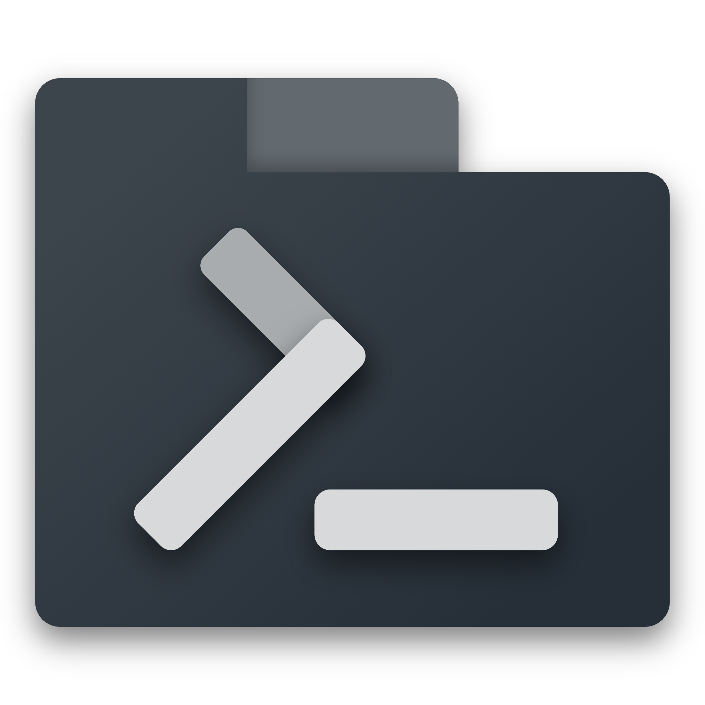
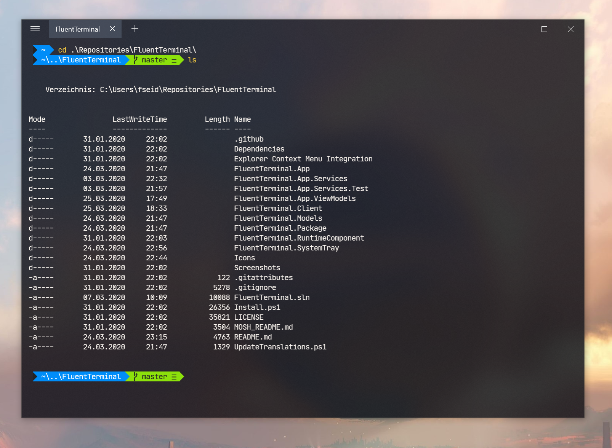
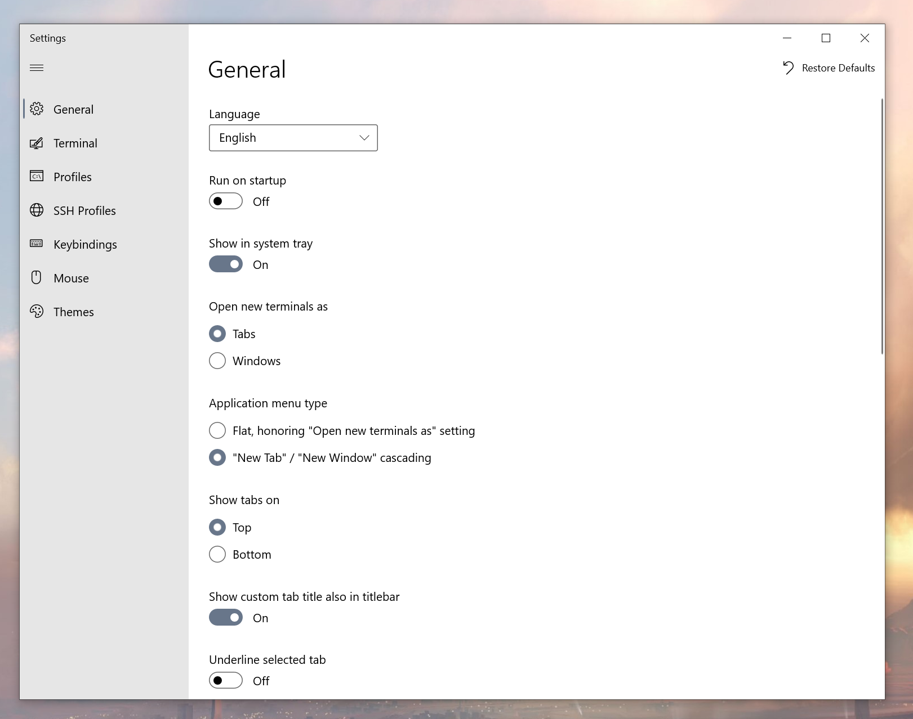

<p align="center">
  
  <h1 align="center">Fluent Terminal</h1>
</p>


[](https://sonarcloud.io/dashboard?id=FluentTerminal)
[](https://gitter.im/FluentTerminal)
[](https://github.com/felixse/FluentTerminal/releases/)
[](https://github.com/felixse/FluentTerminal/releases)
[](https://github.com/felixse/FluentTerminal/graphs/contributors)

A Terminal Emulator based on UWP and web technologies.

## Features

- Terminal for PowerShell, CMD, WSL or custom shells
- Built-in support for SSH and [Mosh](https://mosh.org/) connections
- Supports tabs and multiple windows
- Theming and appearance configuration
- Import/Export themes
- Import iTerm themes
- Fullscreen mode
- Editable keybindings
- Search function
- Configure shell profiles to quickly switch between different shells
- Explorer context menu integration (Installation script can be found [here](https://github.com/felixse/FluentTerminal/tree/master/Explorer%20Context%20Menu%20Integration))

## Screenshots




## Languages
- Arabic
- Arabic (Iraq)
- Azerbaijani
- Chinese (Simplified)
- Chinese (Traditional)
- Dutch
- English
- French
- German
- Hebrew
- Hindi
- Indonesian
- Italian
- Japanese
- Korean
- Polish
- Portuguese (Brazilian)
- Romanian
- Russian
- Spanish
- Ukrainian


Sign up to [POEditor](https://poeditor.com/join/project/TfKNIt826z) to help with existing translations or add a new language

## How to install (as an end-user)

### Prerequisite
- You need to update to Fall Creators Update or later.

### Chocolatey package manager installation

- Install [Chocolatey](https://chocolatey.org/)
- From an elevated/admin shell, execute `choco install fluent-terminal`

### Scoop package manager installation
- [Enable sideloading apps](https://www.windowscentral.com/how-enable-windows-10-sideload-apps-outside-store)
  - Alternatively, [enable developer mode](https://docs.microsoft.com/en-US/windows/uwp/get-started/enable-your-device-for-development) if you plan to do UWP app development. **For most users that do not intend to do UWP app development, developer mode will not be necessary.**
- Install Scoop
- Install 7zip and git (to add buckets): `scoop install 7zip git`
- From an elevated/admin shell, execute
```
 scoop bucket add nonportable
 scoop install fluent-terminal-np
 ```

### Manual

- Download and extract the latest [release](https://github.com/felixse/FluentTerminal/releases).
- Double click the *.appxbundle file.

## How to set up a development environment
Please refer to [this Wiki page](https://github.com/felixse/FluentTerminal/wiki/How-to-set-up-a-development-environment)
